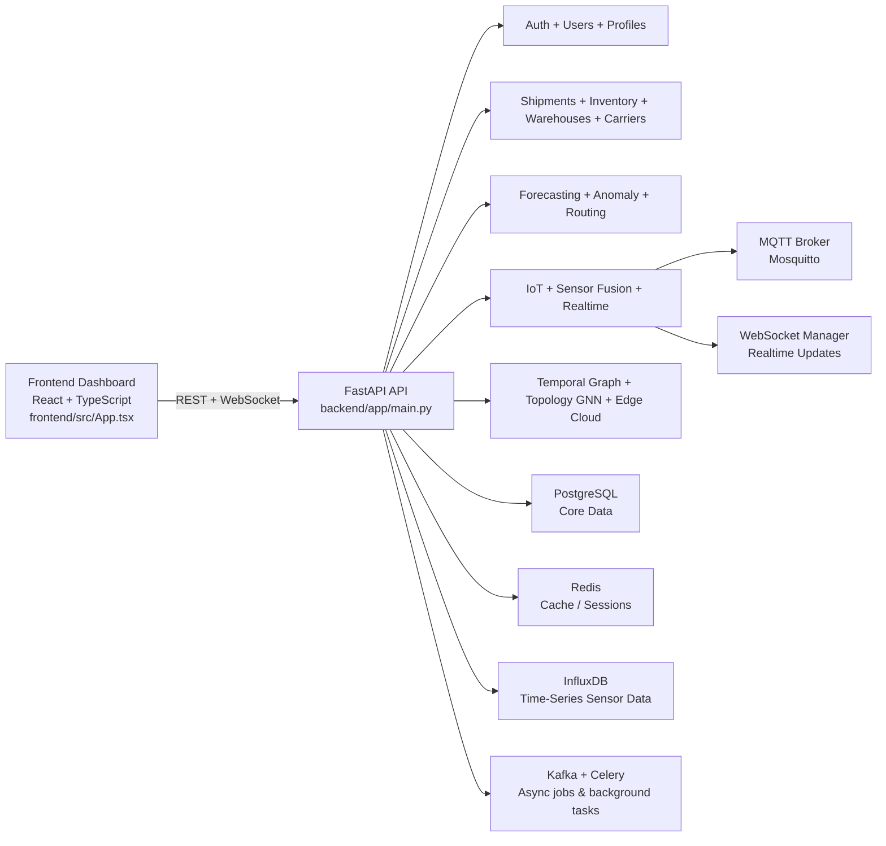

# Supply Chain Management System

AI-powered supply chain analytics and operations platform for tracking shipments, monitoring warehouse inventory, analyzing route performance, and visualizing live IoT sensor data across a connected logistics network.

This repository combines a FastAPI backend, React + TypeScript frontend, and a Docker-based infrastructure stack to provide a complete supply chain dashboard with forecasting, anomaly detection, real-time monitoring, and advanced network analytics.

[](https://fastapi.tiangolo.com/)
[](https://react.dev/)
[](https://www.typescriptlang.org/)
[](https://www.python.org/)
[](https://www.docker.com/)

## Table of Contents

- [What this project does](#what-this-project-does)
- [Why it is useful](#why-it-is-useful)
- [System architecture](#system-architecture)
- [Repository structure](#repository-structure)
- [Tech stack](#tech-stack)
- [Getting started](#getting-started)
- [Running the app with Docker](#running-the-app-with-docker)
- [Development workflow](#development-workflow)
- [Documentation](#documentation)
- [Maintainers and contributions](#maintainers-and-contributions)
- [Support and help](#support-and-help)

## What this project does

This repository is a full-stack supply chain management system built for operations teams that need:

- shipment visibility across carriers and warehouse locations
- real-time inventory tracking and low-stock alerting
- predictive demand forecasting and route optimization
- anomaly detection for operational disruptions
- IoT sensor monitoring for temperature, humidity, and environment tracking
- executive dashboards and analytics for operational decision-making

The application is structured as a monorepo with:

- a Python backend serving REST and WebSocket APIs
- a React + TypeScript frontend dashboard and admin console
- supporting infrastructure for PostgreSQL, Redis, Kafka, MQTT, and time-series data

## Why it is useful

### Core operational benefits

- Monitor shipments, carriers, warehouses, and stock levels from one dashboard.
- Reduce delays by simulating and optimizing delivery routes.
- Track live conditions across the supply chain using IoT sources.
- Detect suspicious inventory or logistics patterns before they become disruptions.
- Give executives faster visibility into KPIs, cost drivers, and operational bottlenecks.

### Advanced analytics and AI

The codebase includes several ML-oriented modules that align with practical supply chain use cases:

- route optimization with graph-based path planning
- forecasting with ARIMA and Prophet-style models
- anomaly detection for unusual shipment or sensor behavior
- probabilistic inventory planning and reallocation logic
- temporal graph analytics for tracing operational relationships over time
- topology-aware graph intelligence for network disruption analysis

These capabilities are implemented as service modules in the backend and surfaced through dedicated dashboard pages in the frontend.

## System architecture



This architecture keeps presentation, business logic, and data ingestion separate while exposing a unified service layer for analytics, monitoring, and operational workflows.

## Repository structure

```text
supply-chain/
├── README.md                         # Project overview and onboarding
├── docker-compose.yml                # Core infrastructure services
├── docs/
│   ├── api/README.md                 # API documentation
│   ├── deployment/                   # Deployment recipes
│   └── user-guide/getting-started.md # Usage guidance
├── backend/
│   ├── app/
│   │   ├── api/v1/                   # REST endpoints
│   │   ├── core/                     # Config, security, Celery setup
│   │   ├── db/                       # SQLAlchemy setup and DB init
│   │   ├── models/                   # ORM models
│   │   ├── schemas/                  # Pydantic schemas
│   │   ├── services/                 # Routing, ML, IoT, real-time logic
│   │   ├── tasks/                    # Background tasks
│   │   └── main.py                   # FastAPI app entrypoint
│   ├── scripts/
│   │   ├── iot_simulator.py          # Simulated sensor input
│   │   └── seed_data.py              # Sample dataset seeding
│   ├── requirements.txt              # Python dependencies
│   ├── alembic/                      # Database migrations
│   ├── DockerFile                    # Backend container build
│   └── verify_system.py              # environment/system verification helper
├── frontend/
│   ├── src/
│   │   ├── features/                 # Dashboard modules and pages
│   │   ├── components/               # Reusable UI and charts
│   │   ├── services/                 # API and websocket clients
│   │   ├── store/                    # Redux state management
│   │   ├── App.tsx                   # SPA bootstrap and routing
│   │   └── main.tsx                  # Frontend bootstrap
│   ├── package.json                  # Frontend scripts and dependencies
│   ├── Dockerfile                    # Frontend container build
│   ├── nginx.conf                    # Nginx reverse proxy config
│   └── README.md                     # Frontend-specific notes
├── infrastructure/
│   ├── docker/
│   ├── mosquitto.conf                # MQTT config
│   └── nginx/                        # Additional proxy config
└── .gitignore
```

## Tech stack

### Backend

- Python 3.10+
- FastAPI
- SQLAlchemy + Alembic
- PostgreSQL
- Redis
- Kafka and Celery
- MQTT (Mosquitto)
- InfluxDB
- scikit-learn, NumPy, pandas, SciPy
- Prophet and statsmodels for forecasting
- Neo4j and NetworkX for graph modeling

### Frontend

- React 19
- TypeScript
- Vite
- Redux Toolkit
- React Router
- Recharts
- Mapbox GL
- Tailwind CSS
- Socket.IO client and WebSocket integration

### Infrastructure

- Docker Compose
- Nginx
- PostgreSQL container
- Redis container
- InfluxDB container
- Kafka + Zookeeper container stack
- MQTT broker container

## Getting started

### Prerequisites

Before running the repo locally, install:

- Python 3.10 or newer
- Node.js 18 or newer
- npm
- Docker and Docker Compose
- PostgreSQL client tools if you want to inspect DB state locally

### Clone the repository

```bash
git clone https://github.com/Jasmine0987/supply-chain.git
cd supply-chain
```

### Environment configuration

The project expects environment variables to support infrastructure services. The root Docker Compose file loads values from `backend/.env`.

Create a backend environment file if needed:

```bash
cp backend/.env.example backend/.env
```

If `.env.example` does not exist in your checkout, use values similar to:

```env
POSTGRES_USER=supplychain
POSTGRES_PASSWORD=your_secure_password
POSTGRES_DB=supplychain
REDIS_PASSWORD=your_redis_password
INFLUXDB_USERNAME=admin
INFLUXDB_PASSWORD=your_influx_password
INFLUXDB_TOKEN=your_influx_token
VITE_API_BASE_URL=http://localhost:8000
VITE_MAPBOX_ACCESS_TOKEN=your_mapbox_token
SECRET_KEY=change_this_value
ALGORITHM=HS256
ACCESS_TOKEN_EXPIRE_MINUTES=30
```

## Running the app with Docker

The repo includes a production-style container setup for all core services.

```bash
docker-compose up --build
```

This starts:

- PostgreSQL at `localhost:5432`
- Redis at `localhost:6379`
- InfluxDB at `localhost:8086`
- Kafka at `localhost:9092`
- MQTT broker at `localhost:1883`
- FastAPI backend at `http://localhost:8000`
- Frontend at `http://localhost:80` or `http://localhost:443`
- Nginx at `http://localhost:8080`

### Useful Docker commands

```bash
docker-compose logs -f backend
docker-compose restart backend
docker-compose down -v
```

## Development workflow

### Backend setup

```bash
cd backend
python -m venv .venv
source .venv/bin/activate  # Windows: .venv\Scripts\activate
pip install -r requirements.txt
uvicorn app.main:app --reload
```

The backend is exposed through routers such as:

- `/api/v1/auth`
- `/api/v1/shipments`
- `/api/v1/inventory`
- `/api/v1/warehouses`
- `/api/v1/routing`
- `/api/v1/forecasting`
- `/api/v1/iot`
- `/api/v1/anomaly`
- `/api/v1/temporal-graph`
- `/api/v1/topology-gnn`
- `/api/v1/edge-cloud`

### Frontend setup

```bash
cd frontend
npm install
npm run dev
```

The frontend entrypoint is `frontend/src/App.tsx`, and it wires the dashboard to the backend through Redux and API service modules.

### Testing

The repository includes backend testing packages and frontend tooling. Typical commands include:

```bash
cd backend
pytest

cd frontend
npm run build
npm run lint
```

## Documentation

This repo contains a few useful documentation paths:

- [docs/api/README.md](docs/api/README.md)
- [docs/user-guide/getting-started.md](docs/user-guide/getting-started.md)
- [docs/deployment/aws-deployment.md](docs/deployment/aws-deployment.md)
- [docs/deployment/heroku-deployment.md](docs/deployment/heroku-deployment.md)
- [docs/deployment/vercel-deployment.md](docs/deployment/vercel-deployment.md)

The FastAPI app also exposes interactive Swagger docs when the environment is in debug mode:

- `http://localhost:8000/docs`
- `http://localhost:8000/redoc`

## Maintainers and contributions

This repository is maintained under the ownership of Jasmine0987 and is intended for active development and community contribution.

If you would like to contribute:

1. Fork the repository.
2. Create a feature branch.
3. Make your changes with clear commit messages.
4. Run the relevant tests and lint checks.
5. Open a pull request with a concise summary of the improvement.

Common contribution areas include:

- API improvements and bug fixes
- frontend dashboard UX improvements
- forecasting and optimization experiments
- IoT simulation and data modeling
- docs and deployment improvements

## Support and help

If you need help or want to understand the repo faster, start with:

- the project root README
- [docs/api/README.md](docs/api/README.md)
- [docs/user-guide/getting-started.md](docs/user-guide/getting-started.md)
- the GitHub Issues tab for the repository

For local debugging, start with the backend entrypoint at `backend/app/main.py` and the frontend entrypoint at `frontend/src/App.tsx`.

## Summary

This project is a practical, end-to-end supply chain management platform that blends operations, analytics, and real-time monitoring in a single application. It is especially useful for teams that want a modern internal dashboard to monitor logistics performance, automate decision-making, and experiment with AI-driven operational analytics.

If you want, I can also generate a shorter GitHub-friendly README version optimized for a polished landing page, or tailor the README specifically toward startup / enterprise / developer audience.
